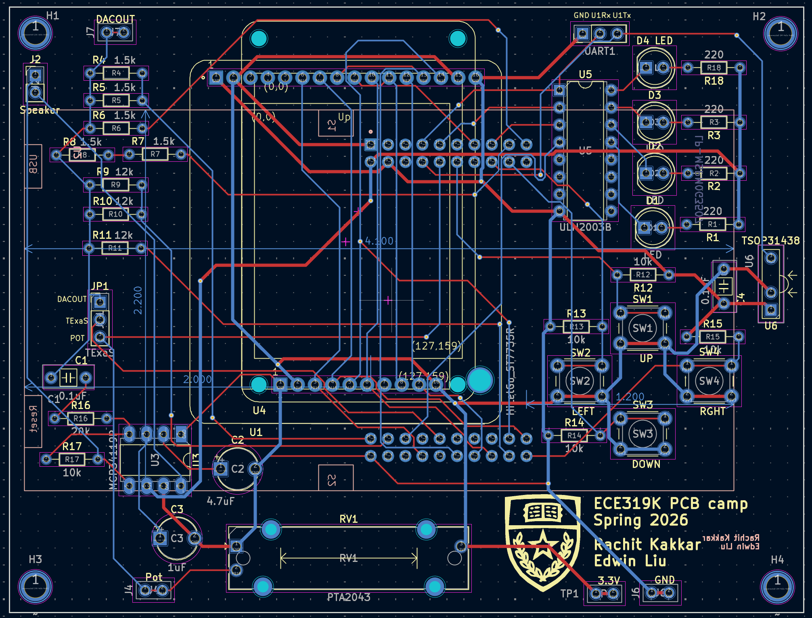
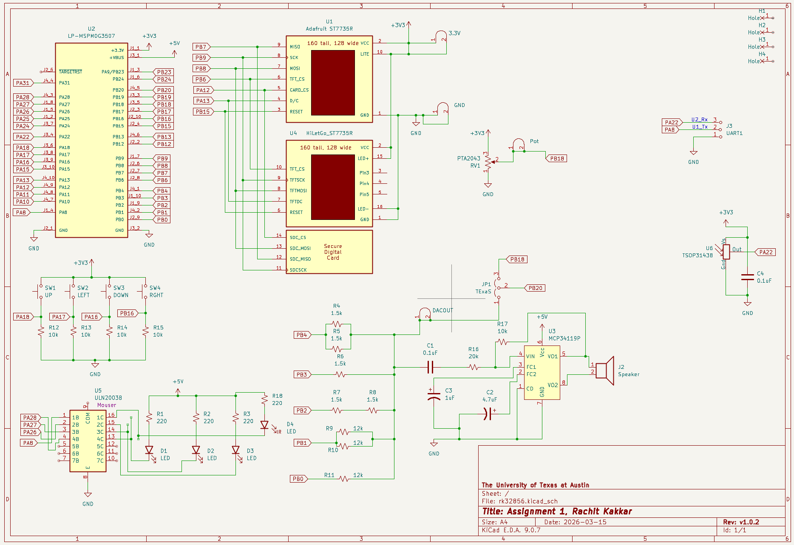

# MSPM0G3507 Digital Storage Oscilloscope

This repository contains the firmware for an Digital Storage Oscilloscope, developed for the Texas Instruments **MSPM0G3507** microcontroller. The project leverages interrupt-driven sampling, real-time graphics rendering to an ST7735 TFT LCD display, and interactive peripherals on a custom PCB designed in KiCAD.

<video controls>
  <source src="demo.mp4" type="video/mp4">
</video>

## Features

- **High-Speed Signal Acquisition**: There is a 50 kHz hardware timer interrupt (TimerG6) to sample the ADC and store the value in a storage buffer. The process of sampling and storing into the buffer only occurs on the rising edge of the signal after it passes a trigger set at the half-way mark in order to capture stable waveforms.
- **Real-Time Display**: Live waveform plotting on an ST7735 TFT LCD with grid generation and zoom. Displaying the waveform only occurs when the buffer is full, upon which the 50 kHz TimerG6 interrupt is disabled in order to plot values onto the LCD. Without this crucial step, the microcontroller would be interrupted before it had time to write to the display as that is a comparitively slow task relative to the frequent timer interrupts. In order to further speed up the display (and prevent the flickering of a whole screen redraw), a buffer of previous samples is stored and only the pixels where the previous waveform are cleared. This also requires dynamically fixing the grid in those spots.
- **Interactive Measurements**: 
  - Dual horizontal and vertical cursors to measure $\Delta V$, $\Delta T$.
  - Real-time on-screen calculations for Peak-to-Peak Voltage ($V_{pp}$) and Frequency.
- **Dynamic Controls**:
  - Discrete zoom levels (1x, 2x, 4x) controlled by an ADC-sampled slide potentiometer and downsampling of the ADC sample buffer.
  - Hardware switch integration for playback control (Play/Pause), cursor selection, and precise cursor movement.
  - Input control is handled by another periodic harderware timer interrupt (TimerG12), this time at a frequency of only 30 Hz.
- **Audio Feedback**: DAC-driven sound generation mapped to UI interactions for tactile and auditory feedback. The audio files are downsampled and stored into a C array, where a periodic SysTick interrupt then outputs the values to the 5-bit DAC on the PCB at a frequency of 11 kHz. To prevent noticiable audio distortion, this interrupt is the highest priority.
- **Localization**: Built-in dual-language support (English and Spanish) for the on-screen display.
- **Debugging**: LED based triple toggle for determing latency of interrupt handler.

## Architecture and Key Components

- **`Lab9HMain.cpp`**: The primary entry point. Registers the 30 Hz UI/Game engine timer interrupt, the 50 kHz ADC sampling timer interrupt, the 11 kHz SysTick interrupt, and the main application loop. Also stores code for the corresponding IRQ handlers.
- **`Oscilloscope.cpp` / `.h`**: Core oscilloscope logic. Handles ADC configuration, sample buffering, trigger-level synchronization, and signal metrics calculations (Frequency, $V_{pp}$).
- **`ST7735.cpp` / `.h`**: Display driver for the SPI-based LCD, including routines for drawing bitmaps, characters, and primitive shapes.
- **`Cursor` & `Application`**: Encapsulates the UI state, grid drawing, and cursor boundary/overlap logic.
- **Peripherals**: Interfaces for `Clock`, `Timer`, `Switch`, `SlidePot`, `LED`, `Sound`, and `DAC5`.

## Hardware

- **Microcontroller**: TI MSPM0G3507 LaunchPad
- **Display**: ST7735 SPI LCD (Adafruit REDTAB or HiLetGo BLACKTAB)
- **Inputs**: 
  - Slide Potentiometer (ADC input)
  - 4 Tactile Switches (Digital GPIO)
- **Outputs**: 
  - 5-bit weighted DAC, amplifier chip, and speaker (for audio)
  - LEDs

The full PCB files are avaliable in the `PCB/` folder

## Build Instructions

This project is built using Code Composer Studio (CCS) and the TI MSPM0-SDK. 

1. Import the project folder into a Code Composer Studio workspace.
2. Ensure the `MSPM0-SDK` (v2.9.0.01 or compatible) and SysConfig are correctly linked in your project properties.
3. Build the project using the **TI Arm Clang Compiler** (`TICLANG`).
4. Flash the `.out` executable onto the MSPM0G3507 LaunchPad.

## Credits

Much of the starter code for this project was developed by the instructors for ECE319H Course at the University of Texas at Austin. 
